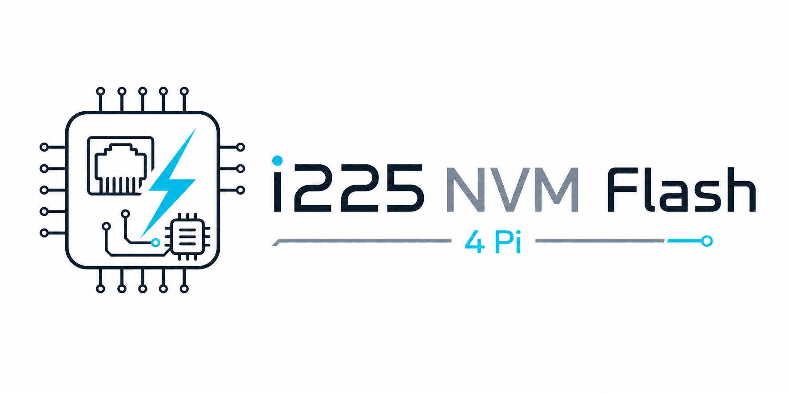

<p align="center">
  
</p>

<h1 align="center">i225 NVM Flash 4 Pi</h1>

<p align="center">
  <a href="https://github.com/ahmadexp/i225-NVM-FLASH/actions/workflows/ci.yml">
    
  </a>
</p>

<p align="center">
  Native Linux/ARM NVM and SPI-flash recovery tooling for Intel i225/i226
  Foxville controllers on Raspberry Pi-class hosts.
</p>

<p align="center">
  <strong>Recovered on real hardware:</strong>
  blank I226 <code>8086:125f</code> to working I226-V <code>8086:125c</code>,
  with permanent MAC programming verified after reboot.
</p>

## Overview

This repo was built to recover an Intel I226-V, including the TimeHat-style
I226-V board, on a Raspberry Pi after the controller enumerated as the
blank-NVM PCI ID `8086:125f` and the Linux `igc` driver refused to bind with an
invalid NVM checksum.

The successful recovery programmed a 1 MB I226-V full-flash image. After
reboot, the controller enumerated as `8086:125c`, the `igc` driver bound, and a
permanent MAC update to `02:a0:c9:12:34:56` persisted across reboot.

## Safety

`flashwrite` is destructive. A wrong image, wrong device, interrupted write, or
unsupported flash part can brick the NIC. Always take two matching backups,
perform a dry-run, and independently dump/compare the programmed image before
rebooting.

By default, `flashwrite` patches a fresh locally administered unicast MAC into
the image before programming. Compare post-write dumps against the printed
`patched_...mac-...bin` file, or pass `--keep-image-mac` if you intentionally
want the input image's MAC bytes unchanged.

This project is not affiliated with Intel, Raspberry Pi, or any board vendor.
Firmware binaries are not vendored here.

## Wiki

Start with the source-controlled wiki pages:

| Page | Purpose |
| --- | --- |
| [Wiki Home](docs/wiki/Home.md) | Documentation map and tested hardware summary |
| [Safety Checklist](docs/wiki/Safety-Checklist.md) | Prewrite and postwrite safety checks |
| [Recovery Guide](docs/wiki/Recovery-Guide.md) | End-to-end blank I226 recovery flow |
| [Permanent MAC Address](docs/wiki/Permanent-MAC-Address.md) | Full-flash MAC programming procedure |
| [Command Reference](docs/wiki/Command-Reference.md) | CLI commands, options, and risk levels |
| [Hardware and Firmware](docs/wiki/Hardware-and-Firmware.md) | Tested hardware matrix and image metadata |
| [Visual Assets](docs/wiki/Visual-Assets.md) | Stamp logo and GitHub social preview sources |
| [Troubleshooting](docs/wiki/Troubleshooting.md) | Common failures, symptoms, and fixes |
| [Publishing the Wiki](docs/wiki/Publishing-the-Wiki.md) | Maintainer workflow for syncing GitHub Wiki |

The source-controlled wiki lives in `docs/wiki/`. Maintainers can publish it to
GitHub Wiki with `scripts/publish-wiki.sh` or the manual `Publish Wiki` GitHub
Actions workflow.

## License

Copyright (c) 2026 Ahmad Byagowi. All rights reserved.

This repository is source-available under the custom license in [LICENSE](LICENSE).
The code, documentation, and logo may not be redistributed, relicensed, sold, or
used commercially without written permission from the author.

## Tested Recovery

Tested target:

| Item | Value |
| --- | --- |
| Host | Raspberry Pi, ARM64 Linux |
| PCI BDF | `0001:01:00.0` |
| Before flash | `8086:125f`, `I226 (blank NVM)` |
| After flash | `8086:125c`, `Intel Ethernet Controller I226-V` |
| Driver after reboot | `igc` |
| Flash size on this board | 1 MB |
| Programmed image | `FXVL_125C_V_1MB_2.32.bin` |

The tested board had an SST/Microchip SPI flash. Its status register initially
reported `0x1c`, meaning block-protect bits were set. Current `flashwrite`
clears the common protection bits before erase/program.

## Firmware Image

The firmware binary is not vendored in this repo. Fetch it from the exact
source commit used for the recovery:

```sh
git clone https://github.com/ahmadexp/Intel-I226-V-NVM-Firmware.git firmware-src
cd firmware-src
git checkout 63b84a447449af2368a18bd1cf214ccf22ffbd40
sha256sum I226-V/2.32/FXVL_125C_V_1MB_2.32.bin
```

Expected binary details:

| Field | Value |
| --- | --- |
| Source repo | `https://github.com/ahmadexp/Intel-I226-V-NVM-Firmware` |
| Source commit | `63b84a447449af2368a18bd1cf214ccf22ffbd40` |
| File | `I226-V/2.32/FXVL_125C_V_1MB_2.32.bin` |
| Size | `1048576` bytes |
| SHA-256 | `881434a8e54ebaf70117dd5061c3a2f04b16fe1cc3e443777337fb6774892024` |
| ETrack ID | `0x80000425` |
| Programmed PCI ID in image | `8086:125c` |

Do not use the I225 `15F2` images for an I226 blank-NVM device. Do not use the
2 MB I226 image on the tested board; a 2 MB attempt failed near the halfway
point because the fitted flash is 1 MB.

## Build

Build natively on the Raspberry Pi:

```sh
make clean
make
```

Cross-compile from another Linux host:

```sh
make CROSS=aarch64-linux-gnu-
```

The tool must run as root because it maps PCI BAR0 and accesses NVM control
registers.

## Repository Layout

| Path | Purpose |
| --- | --- |
| `src/` | C implementation for PCI discovery, NVM access, flash access, and image helpers |
| `docs/wiki/` | Source-controlled GitHub Wiki pages |
| `.github/` | CI workflow, issue templates, and pull request template |
| `assets/` | Repository artwork, stamp logo, and GitHub social preview |
| `RE_NOTES.md` | Reverse-engineering notes and validation evidence |

## Contributing and Support

See [CONTRIBUTING.md](CONTRIBUTING.md), [SUPPORT.md](SUPPORT.md), and
[SECURITY.md](SECURITY.md). Do not commit firmware binaries, private dumps,
or proprietary Intel updater files.

## Quick Identification

Find the controller and confirm whether it is still blank:

```sh
lspci -nn | grep -Ei '8086:125f|8086:125c|i225|i226|ethernet'
sudo ./i225nvm list
```

For the tested Pi setup:

```sh
BDF=0001:01:00.0
```

Before recovery, `igc` logged:

```text
The NVM Checksum Is Not Valid
probe with driver igc failed with error -5
```

Blank or invalid NVM can leave PCI `COMMAND.MEM` disabled and BAR0 programmed as
zero after the failed driver probe. `i225nvm` repairs that locally by restoring
BAR0 from sysfs `resource0` and enabling MMIO before mapping BAR0.

## Reproducible Flash Procedure

These commands assume the firmware repo was cloned next to this repo. Adjust
paths if your layout differs.

1. Prepare directories and copy the known-good 1 MB image:

```sh
mkdir -p firmware backups
cp ../firmware-src/I226-V/2.32/FXVL_125C_V_1MB_2.32.bin firmware/
sha256sum firmware/FXVL_125C_V_1MB_2.32.bin
```

Expected hash:

```text
881434a8e54ebaf70117dd5061c3a2f04b16fe1cc3e443777337fb6774892024
```

2. If `igc` is bound, unbind it before raw NVM work:

```sh
if [ -e /sys/bus/pci/devices/$BDF/driver/unbind ]; then
  printf '%s\n' "$BDF" | sudo tee /sys/bus/pci/devices/$BDF/driver/unbind
fi
```

3. Take two explicit 1 MB prewrite backups and compare them:

```sh
sudo ./i225nvm flashdump -b "$BDF" -s 1048576 -o backups/prewrite-1mb-a.bin
sudo ./i225nvm flashdump -b "$BDF" -s 1048576 -o backups/prewrite-1mb-b.bin
sha256sum backups/prewrite-1mb-a.bin backups/prewrite-1mb-b.bin
cmp backups/prewrite-1mb-a.bin backups/prewrite-1mb-b.bin
```

Stop if the two backups differ.

4. Optional: read the SPI flash status register. On the recovery board this was
`0x1c` before clearing protection.

```sh
sudo I225NVM_OP=4 I225NVM_COUNT=1 ./i225nvm flsw -b "$BDF"
```

Current `flashwrite` clears common block-protect bits automatically. If you are
using an older build, the manual clear sequence is:

```sh
sudo I225NVM_OP=6 I225NVM_COUNT=0 ./i225nvm flsw -b "$BDF"
sudo I225NVM_OP=5 I225NVM_COUNT=1 I225NVM_DATA=0x00 ./i225nvm flsw -b "$BDF"
sudo I225NVM_OP=4 I225NVM_COUNT=1 ./i225nvm flsw -b "$BDF"
```

5. Dry-run the write. This takes another automatic backup, chooses a random
locally administered MAC, saves a `patched_...mac-...bin` reference image, but
does not erase:

```sh
sudo ./i225nvm flashwrite -b "$BDF" \
  -i firmware/FXVL_125C_V_1MB_2.32.bin
```

If you want the real write to use the same MAC printed by the dry-run, add
`--mac <printed-mac>` to the write command. Otherwise, the write will choose a
new random MAC by default.

6. Perform the destructive write. Record the `patched_...mac-...bin` path it
prints:

```sh
sudo ./i225nvm flashwrite -b "$BDF" \
  -i firmware/FXVL_125C_V_1MB_2.32.bin \
  --write --force-flash
```

Expected success line:

```text
SUCCESS: full flash programmed and verified. Reboot to apply.
```

7. Take an independent post-write dump and compare it to the patched image that
was printed during the write:

```sh
sudo ./i225nvm flashdump -b "$BDF" -s 1048576 -o backups/postwrite-1mb.bin
sha256sum backups/postwrite-1mb.bin patched_0001:01:00.0_YYYYMMDD_HHMMSS_mac-xx-xx-xx-xx-xx-xx.bin
cmp backups/postwrite-1mb.bin patched_0001:01:00.0_YYYYMMDD_HHMMSS_mac-xx-xx-xx-xx-xx-xx.bin
```

Both hashes should match. If you used `--keep-image-mac`, compare against the
original input image instead.

8. Reboot so PCIe/NVM auto-load uses the new flash contents:

```sh
sudo reboot
```

9. Verify after reboot:

```sh
lspci -nn -s "$BDF"
lspci -nn -vv -s "$BDF" | sed -n '1,20p'
dmesg | grep -Ei 'igc|i225|i226|125c|125f|NVM' | tail -40
ip -br link
```

Expected result:

```text
Intel Corporation Ethernet Controller I226-V [8086:125c]
Kernel driver in use: igc
```

On the recovered board, the interface appeared as `eth1`.

## Permanent MAC Address

The permanent MAC address is stored in the first six bytes of the full SPI
flash image. These bytes are also exposed after boot as shadow-NVM words
`0x00..0x02`:

| NVM word | File bytes | Meaning |
| --- | --- | --- |
| `0x00` | `0..1` | MAC bytes 0 and 1 |
| `0x01` | `2..3` | MAC bytes 2 and 3 |
| `0x02` | `4..5` | MAC bytes 4 and 5 |

On the tested I226-V, writing only the shadow-NVM words with `write -n 64`
verified before reboot but did not persist across reboot. For a permanent
change, program the full image with `flashwrite`; it patches bytes `0..5` and
recomputes checksum word `0x3f` before writing.

Use a unique unicast MAC address. A `02:...` prefix is suitable for a locally
administered address; do not reuse Intel's public OUI unless you have an
assigned address.

By default `flashwrite` picks a fresh random locally administered unicast MAC
and saves the exact patched image as `patched_...mac-...bin`.

Example with the default random MAC:

```sh
BDF=0001:01:00.0
SRC=firmware/FXVL_125C_V_1MB_2.32.bin

sudo ./i225nvm flashwrite -b "$BDF" -i "$SRC"
```

The dry-run prints the generated MAC and a patched image path. To reuse that
same MAC on the real write:

```sh
MAC=02:a0:c9:12:34:56  # replace with the MAC printed by the dry-run

sudo ./i225nvm flashwrite -b "$BDF" -i "$SRC" \
  --mac "$MAC" \
  --write --force-flash
```

For a deterministic MAC from the start, pass `--mac` to both dry-run and write:

```sh
MAC=02:a0:c9:12:34:56

sudo ./i225nvm flashwrite -b "$BDF" -i "$SRC" --mac "$MAC"

if [ -e /sys/bus/pci/devices/$BDF/driver/unbind ]; then
  printf '%s\n' "$BDF" | sudo tee /sys/bus/pci/devices/$BDF/driver/unbind
fi

sudo ./i225nvm flashwrite -b "$BDF" -i "$SRC" --mac "$MAC" --write --force-flash
```

Take an independent dump and compare before rebooting:

```sh
sudo ./i225nvm flashdump -b "$BDF" -s 1048576 -o backups/post-mac-1mb.bin
sha256sum patched_0001:01:00.0_YYYYMMDD_HHMMSS_mac-02-a0-c9-12-34-56.bin backups/post-mac-1mb.bin
cmp patched_0001:01:00.0_YYYYMMDD_HHMMSS_mac-02-a0-c9-12-34-56.bin backups/post-mac-1mb.bin
sudo reboot
```

After reboot, confirm the address from Linux and from shadow NVM:

```sh
ip -br link
cat /sys/class/net/eth1/address
sudo ./i225nvm dump -b "$BDF" -n 64 -o shadow-after-mac.bin
sudo ./i225nvm checksum -b "$BDF"
```

## Restore

For raw-flash recovery, restore with `flashwrite`, not the shadow-RAM `write`
command. Use `--keep-image-mac` when restoring an exact backup:

```sh
sudo ./i225nvm flashwrite -b "$BDF" \
  -i backups/prewrite-1mb-a.bin \
  --keep-image-mac --write --force-flash
```

Keep every `backup_<bdf>_<timestamp>.bin` produced by `flashwrite`; those are
the automatic prewrite raw-flash backups.

## Command Summary

Read-only commands:

```sh
sudo ./i225nvm list
sudo ./i225nvm checksum -b "$BDF"
sudo ./i225nvm dump -b "$BDF" -o shadow.bin
sudo ./i225nvm flashdump -b "$BDF" -s 1048576 -o full.bin
```

Shadow-RAM commands, for config-word repair only:

```sh
sudo ./i225nvm write -b "$BDF" -i shadow.bin
sudo ./i225nvm write -b "$BDF" -i shadow.bin --write --fix-checksum
sudo ./i225nvm verify -b "$BDF" -i shadow.bin
```

Raw full-flash commands, for whole firmware images:

```sh
sudo ./i225nvm flashwrite -b "$BDF" -i image.bin
sudo ./i225nvm flashwrite -b "$BDF" -i image.bin --mac 02:a0:c9:12:34:56
sudo ./i225nvm flashwrite -b "$BDF" -i image.bin --keep-image-mac
sudo ./i225nvm flashwrite -b "$BDF" -i image.bin --write --force-flash
```

## Implementation Notes

The tool uses BAR0 MMIO through Linux sysfs resources. It does not need Intel's
x86-only `/dev/nal` path.

Relevant Foxville registers:

| Register | Offset | Purpose |
| --- | --- | --- |
| `EERD` | `0x12014` | EEPROM-mode shadow-RAM read |
| `SRWR`/`EEWR` | `0x12018` | EEPROM-mode shadow-RAM write |
| `FLA` | `0x1201c` | Flash access/status, size hint, abort clear |
| `FLSWCTL` | `0x12048` | Software flash command/address/status |
| `FLSWDATA` | `0x1204c` | Software flash data |
| `FLSWCNT` | `0x12050` | Software flash byte count |
| `FLSECU` | `0x12114` | Flash security status |

FLSW command opcodes used here:

| Opcode | Meaning |
| --- | --- |
| `0` | Read |
| `1` | Write/page program |
| `2` | 4 KB sector erase |
| `3` | Device erase |
| `4` | Read SPI status register |
| `5` | Write SPI status register |
| `6` | Write enable |
| `8` | Read JEDEC ID |

FLSW status bits:

| Bit | Mask |
| --- | --- |
| `CMDV` | `0x10000000` |
| `FLBUSY` | `0x20000000` |
| `DONE` | `0x40000000` |
| `GLDONE` | `0x80000000` |

`flashwrite` waits for idle, erases 4 KB sectors, writes with one-byte FLSW
program transactions, skips already-erased `0xff` bytes, and verifies by reading
the image back. On the tested I226-V/SST flash, larger FLSW write counts only
programmed the low byte of `FLSWDATA`; byte transactions were required for a
correct full-image verify.

## Files

| File | Purpose |
| --- | --- |
| `src/igc_regs.h` | i225/i226 register and bit definitions |
| `src/pci.[ch]` | sysfs PCIe discovery, BAR0 repair, mmap, MMIO accessors |
| `src/nvm.[ch]` | semaphore, `EERD`/`SRWR`, checksum, `FLUPD` commit |
| `src/flash.[ch]` | raw SPI flash via `FLSW`, unprotect, erase, program, verify |
| `src/image.[ch]` | `.bin` load/save helpers |
| `src/main.c` | CLI commands |
| `RE_NOTES.md` | reverse-engineering notes and bench log |

## References

- Firmware image source:
  `https://github.com/ahmadexp/Intel-I226-V-NVM-Firmware`
- Foxville/I225 software manual mirror used for register/flow confirmation:
  `https://dokumen.pub/intel-foxville-i225-25-gbps-ethernet-controller-software-user-manual-13nbsped.html`
- Public i210 FLSW implementation used for cross-checking command flow:
  `https://lore.barebox.org/barebox/1453089161-6697-19-git-send-email-andrew.smirnov%40gmail.com/`
